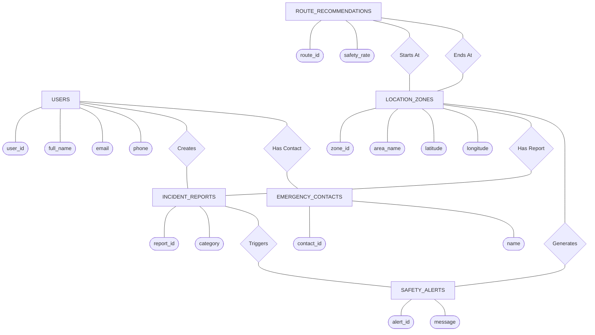

# SafeRoute BD 🛡️
**Smart Community Safety & Incident Management System — Bangladesh**
> *Report. Track. Stay Safe.*
---
## Project Structure
```
SafeRoute BD/
├── frontend/           ← HTML / CSS / JS pages
│   ├── index.html          Landing page
│   ├── register.html       User registration
│   ├── login.html          Login page
│   ├── user-dashboard.html Public user dashboard
│   ├── admin-dashboard.html Admin control panel
│   ├── css/style.css       Global stylesheet
│   └── js/
│       ├── register.js     Registration logic
│       └── login.js        Login logic
│
└── backend/            ← Node.js + Express API
    ├── server.js           Entry point
    ├── .env.example        Environment template → copy to .env
    ├── package.json
    ├── config/db.js        Oracle DB connection pool
    ├── routes/auth.js      POST /register, POST /login
    ├── middleware/
    │   └── authMiddleware.js  JWT verification
    └── db/schema.sql       Oracle schema (run once)
```
---
## Quick Start
### 1. Set up Oracle Database
Run `backend/db/schema.sql` in SQL*Plus or SQL Developer:
```sql
@schema.sql
```
### 2. Configure environment
```bash
cd backend
copy .env.example .env
# Edit .env with your Oracle DB credentials and a JWT secret
```
### 3. Install backend dependencies
```bash
cd backend
npm install
```
### 4. Start the backend
```bash
npm start
# → Running at http://localhost:3000
# → Health check: http://localhost:3000/api/health
```
### 5. Open the frontend
Open `frontend/index.html` in your browser, or use [Live Server](https://marketplace.visualstudio.com/items?itemName=ritwickdey.LiveServer) in VS Code.
---
## API Endpoints
| Method | Path | Description |
|--------|------|-------------|
| `POST` | `/api/auth/register` | Register a new user |
| `POST` | `/api/auth/login` | Login, returns JWT |
| `GET`  | `/api/health` | Server health check |
### Register payload
```json
{
  "full_name": "Rahim Ahmed",
  "email": "rahim@example.com",
  "phone": "01700000000",
  "password": "SecurePass1!",
  "role": "PUBLIC_USER"
}
```
### Login payload
```json
{
  "email": "rahim@example.com",
  "password": "SecurePass1!"
}
```
---
## Database Schema (ER Diagram)
## Schema Diagram

```mermaid
erDiagram
    USERS ||--o{ INCIDENT_REPORTS : "creates"
    USERS ||--o{ EMERGENCY_CONTACTS : "has"
    LOCATION_ZONES ||--o{ INCIDENT_REPORTS : "has"
    LOCATION_ZONES ||--o{ SAFETY_ALERTS : "generates"
    INCIDENT_REPORTS ||--o| SAFETY_ALERTS : "triggers"
    LOCATION_ZONES ||--o{ ROUTE_RECOMMENDATIONS : "is start of"
    LOCATION_ZONES ||--o{ ROUTE_RECOMMENDATIONS : "is end of"
    
    USERS {
        NUMBER user_id PK
        VARCHAR2 full_name
        VARCHAR2 email UK
        VARCHAR2 phone
        VARCHAR2 password_hash
        VARCHAR2 role
        TIMESTAMP created_at
    }
    LOCATION_ZONES {
        NUMBER zone_id PK
        VARCHAR2 area_name
        FLOAT latitude
        FLOAT longitude
        FLOAT safety_score
        NUMBER is_high_risk
    }
    INCIDENT_REPORTS {
        NUMBER report_id PK
        NUMBER user_id FK
        NUMBER zone_id FK
        VARCHAR2 category
        VARCHAR2 description
        NUMBER is_anon
        NUMBER upvotes
        VARCHAR2 status
        TIMESTAMP created_at
    }
    EMERGENCY_CONTACTS {
        NUMBER contact_id PK
        NUMBER user_id FK
        VARCHAR2 name
        VARCHAR2 phone
        VARCHAR2 relation
    }
    SAFETY_ALERTS {
        NUMBER alert_id PK
        NUMBER zone_id FK
        NUMBER report_id FK "nullable"
        VARCHAR2 message
        VARCHAR2 severity
        TIMESTAMP broadcast
    }
    ROUTE_RECOMMENDATIONS {
        NUMBER route_id PK
        NUMBER start_zone FK
        NUMBER end_zone FK
        FLOAT safety_rate
        DATE last_calc
    }
```

---
## ER Diagram (Chen Notation)

---
## Tech Stack
| Layer | Technology |
|-------|-----------|
| Frontend | HTML5, Vanilla CSS, Vanilla JS |
| Backend | Node.js 18+, Express 4 |
| Database | Oracle DB (SEQUENCE + TRIGGER) |
| Auth | JSON Web Tokens (JWT) |
| Passwords | bcryptjs (salt rounds: 12) |
---
